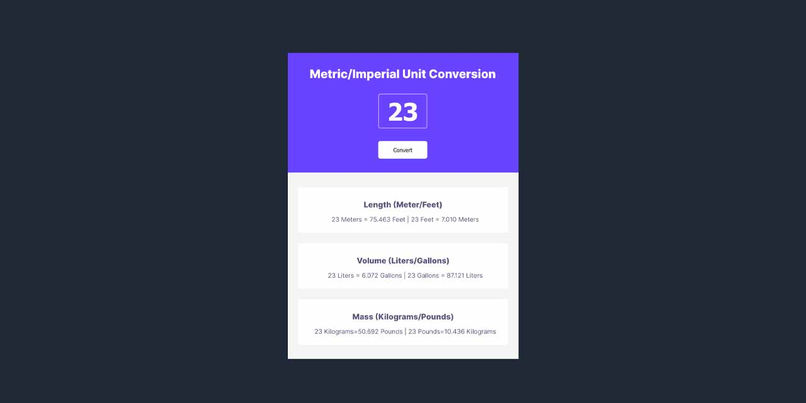

# Scrimba Solo Project-Units Converter

## Table of Contents

- [Overview](#overview)
- [Requirements](#requirements)
- [Live Website](#live-website)
- [Screen Shots](#screen-shots)
- [Author](#author)

## Overview

Besides learning Frontend Development at Winc Academy, Amsterdam, I also love getting hands on by various challenges online. In this project I am required to create an app that converts units.

## Requirements

- [x] Follow the design specs from a [figma file](https://www.figma.com/file/cqtGul0V8RFXY4vTcIv1Kc/Unit-Conversion?node-id=0%3A1&t=zX9bh210H95lJiEM-0)
- [x] Generate all the conversions when the user clicks 'convert'.
- [x] Round the numbers down to 3 decimal places.

## Live Website

[Click here to go to the Live Site](https://beaulaekka.github.io/UnitsConverter/)

## Screen Shots

## Author

[Beaula Ekka Linkedin](https://www.linkedin.com/in/beaula-ekka-favejee-97316558/)

[Beaula Ekka Behance](https://www.behance.net/beaula)
